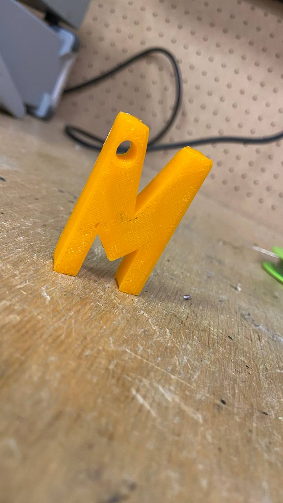

# Брелок с помощью 3D-печати

**Цель работы :** 

Освоение 3D - печати и ознакомления с программами Rhinoceros 6 ; PrusaSlicer .

**Ход работы :** 

 ⁃ Создание 3D-модели в формате STL;

 https://github.com/madinakhakimova/Keychain-/assets/144451345/9708facf-4b66-4099-82a7-384a2b2854fe

 
 ⁃ Генерация слоев для 3D-печати;
 
 ⁃ Перенос файла на принтер с помощью карта памяти; 
 
 ⁃ Запуск печати;
 
 ⁃ Финишный этап : удаления каймы.

https://github.com/madinakhakimova/Keychain-/assets/144451345/13243496-4cb2-4d80-bb64-83079c248617

Оборудование : **Prusa i3 MK3**  

Температура нагрева : 200-250 градус

Длительность печати :  зависит от заданного параметра 

Рис1.Результат

.jpg)

**Все заданные параметры(высота слоя,толщины стенки)  влияют на качество и время печати !**

